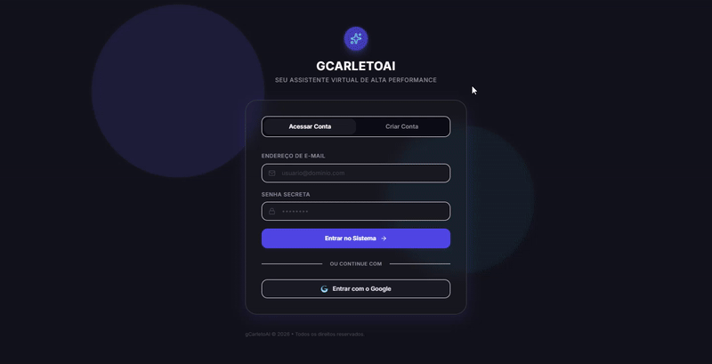

<div align="center">

# ✨ gCarletoAI

**Chatbot web com IA integrada, construído do zero — do banco de dados ao frontend.**


</div>



---

## 📌 Sobre o projeto

O **gCarletoAI** é um chatbot web no estilo ChatGPT, desenvolvido para explorar a integração entre um frontend moderno em React e um backend de IA orquestrado via **N8N**. O projeto nasceu de um problema real do dia a dia — dúvidas de cálculo respondidas manualmente por uma pessoa — e virou uma aplicação completa, com autenticação, histórico de conversas por usuário e tema claro/escuro.

Este é um projeto pessoal construído para aprofundar conhecimento em arquitetura fullstack, modelagem de banco de dados relacional com Row Level Security, e integração de IA via workflows automatizados.

## 🚀 Funcionalidades

- 🔐 **Autenticação** de usuários (cadastro e login)
- 💬 **Chat com IA** — respostas geradas via workflow N8N + modelo GPT-OSS
- 🗂️ **Histórico de conversas** por usuário, com renomear e excluir
- 👤 **Perfil de usuário** editável
- 🌗 **Tema claro/escuro** com persistência local
- 📱 Interface responsiva (sidebar retrátil em mobile)
- 🎨 Design com paleta baseada em Material Design 3

## 🛠️ Stack técnica

| Camada | Tecnologia |
|---|---|
| **Frontend** | React + TypeScript + Vite |
| **Estilização** | Tailwind CSS (paleta customizada via CSS Variables, com suporte a temas) |
| **Backend / Banco** | Supabase (PostgreSQL, Auth, API REST via PostgREST, Row Level Security) |
| **IA** | N8N (orquestração via webhook) + GPT-OSS |
| **Deploy** | EasyPanel (VPS) |

## 🧠 Decisões de arquitetura

- **Autenticação e dados via Supabase**: aproveitando Auth nativo + Postgres com **RLS (Row Level Security)**, garantindo que cada usuário só acesse suas próprias conversas e mensagens no nível do banco — não apenas na camada de aplicação.
- **IA desacoplada via N8N**: em vez de acoplar a lógica de IA diretamente ao backend, o frontend consome um **webhook N8N**, que orquestra a chamada ao modelo (GPT-OSS). Isso separa a lógica de negócio da lógica de IA e facilita trocar de modelo/provedor sem tocar no frontend.
- **Tema claro/escuro via CSS Variables**: toda a paleta de cores é definida como variáveis CSS, mapeadas no `tailwind.config.js`. Trocar de tema é apenas alternar uma classe na tag `<html>` — nenhum componente precisa saber qual tema está ativo.

## 🐛 Desafios técnicos superados

Durante o desenvolvimento, resolvi (na ordem) problemas de: cache de schema do PostgREST desatualizado, ordenação de migrations com foreign keys, permissões RLS vs. GRANT, divergência de nomes de coluna entre frontend e banco, CORS entre frontend e webhook N8N, e reestruturação da paleta de cores para suportar múltiplos temas sem duplicar componentes.

📄 O passo a passo completo de cada erro, causa raiz e solução está documentado em [`TROUBLESHOOTING.md`](./TROUBLESHOOTING.md) — mantive esse histórico como prática de documentação técnica.

## 💻 Rodando localmente

```bash
git clone https://github.com/carletodev/GcarletoAI---ChatBot.git
cd GcarletoAI---ChatBot
npm install
npm run dev
```

Crie um `.env` na raiz com base no `.env.example`:

```env
VITE_SUPABASE_URL=SUA_SUPABASE_URL
VITE_SUPABASE_ANON_KEY=SUA_SUPABASE_ANON_KEY
VITE_N8N_WEBHOOK_URL=https://SEU_DOMINIO.app.n8n.cloud/webhook/ai-assistant
```

Para aplicar as migrations do banco:
```bash
npx supabase login
npx supabase link --project-ref SEU_PROJECT_REF
npx supabase db push
```

## 🗺️ Próximos passos

- [ ] Deploy em produção (EasyPanel)
- [ ] Streaming de resposta da IA (SSE/WebSockets) para reduzir a percepção de espera
- [ ] Otimização de performance do workflow N8N

## 📬 Contato

**Gustavo Carleto Prado dos Santos**

- 📧 [gustavocarleto2304@gmail.com](mailto:gustavocarleto2304@gmail.com)
- 💼 [LinkedIn](https://www.linkedin.com/in/gustavo-carleto-prado-dos-santos-1b9804308/)
- 🐙 [GitHub](https://github.com/carletodev)

---

<div align="center">
<sub>Desenvolvido por Gustavo Carleto Prado dos Santos</sub>
</div>
